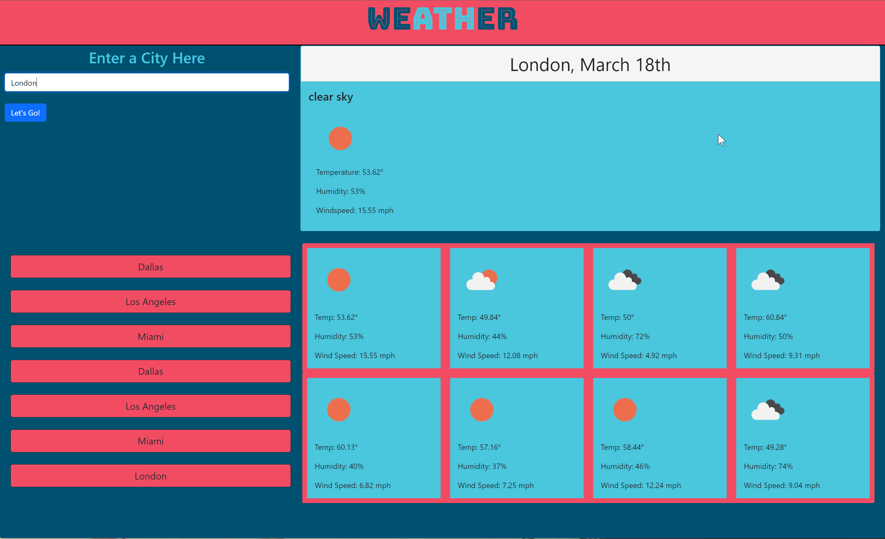

# Weather_Dashboard

## Objectives

Creating a weather dashboard that allowed the use of an external API to gather the database for daily forecasts and distribute that information to the application in a user friendly way. The search feature uses the API to gather the information and display it dynamically to the page. We were also asked to utilize the local storage to create a psuedo search history that allowed users to see previously searched cities. 

The API for forecasting only allows the use of lattitude and longitude navigational information to search for cities and the use of a geocoder to convert those values to a friendly user search. 

#### Collaborators

Devin Wulf
Eugene Ahn
Kelly Jeffries
Vidal Tan

### Screenshot of Final Page

### Link to Final Page

[Weather Dashboard](https://victorini1.github.io/Weather_Dashboard/)